# Hi there! 👋🏻 Welcome to Harsh Github Profile! 💻 

## About me :mortar_board:
**Senior DevOps & Platform Engineer** and **Senior Cloud Security Engineer** with **4+ years** of hands-on experience owning multi-cloud infrastructure (**GCP / AWS / Azure**), Kubernetes orchestration, and infrastructure-as-code. Recently promoted at Accenture (June 2026), driving enterprise security delivery, DevSecOps transformation, and AI-augmented infrastructure automation at scale.

Proven track record includes **80% reduction** in production vulnerabilities, **50% decrease** in system downtime, and **60% improvement** in deployment efficiency. Recognized with multiple ACE awards, including the Tech Innovator Award and Microsoft Cybersecurity HOL Jury Award. Actively leveraging LLM-based automation to accelerate DevOps workflows — targeting DevOps, Platform Engineering, and MLOps / AI-Infrastructure roles.

## My Skills :computer:
- **Cloud & Infrastructure** ☁️
  - **Cloud Platforms**: Google Cloud Platform (GCP), AWS, Azure
  - **IaC & Provisioning**: Terraform, Terraform JSON configs, dynamic provisioning
  - **Containers & Orchestration**: Kubernetes, Docker, Helm, ArgoCD, ECK (Elastic Cloud on Kubernetes), vLLM

- **CI/CD & DevSecOps** ♾️
  - **Pipelines**: GitHub Actions, Jenkins
  - **Security & Policy**: Trivy, Prisma Cloud (Twistlock), OPA, Kyverno, OAuth 2.0, OIDC / CIDP
  - **Monitoring & Observability**: Prometheus, Grafana, ELK Stack, Blackbox Exporter, Gatus

- **Languages, Data & AI** 🤖
  - **Scripting**: Python, Bash
  - **Data & AI Platform**: Snowflake, Streamlit, Open WebUI
  - **AI & LLM Tools**: Claude CLI, ChatGPT, n8n, MCP Server, Ollama, LM Studio, HuggingFace Hub, Stable Diffusion, PagedAttention, Quantization (INT8)

- **Full Stack** 🌐
  - **Frameworks / Libraries**: Next.js, React, Node.js, Express, WordPress
  - **Databases**: MongoDB, MySQL, PostgreSQL
  - **CSS Frameworks**: Bootstrap, Tailwind CSS, Material UI
  - **Version Control & Tracking**: Git, GitHub, Bitbucket, Jira, ServiceNow
  - **Documentation**: Confluence, Markdown, Power BI

- **Hobby & Interests** 🏃🏻‍♂️
	- Coding
	- Cyber Security
	- Gaming
	- IoT Projects
	- Building PCs
	- Listening to Music

## Experience Highlights 💼
**Accenture** — Oct 2022 – Present
- **Senior DevOps & Platform Engineer** (June 2026 – Present) — Leading vulnerability remediation across enterprise GKE, Terraform IaC optimization, ECK adoption, and Gatus monitoring for OAuth/CIDP-secured APIs
- **DevOps & Platform Engineer** (Jun 2024 – May 2026) — Owned security for a 100+ node GKE cluster (80% vuln reduction); Blackbox Exporter monitoring (+90% reliability); zero-downtime Elasticsearch v7→v8 migration
- **DevOps Engineer** (Oct 2022 – May 2024) — Pipelines for 100+ apps on Kubernetes; Prometheus/Grafana early-warning alerts (50% less downtime)

## Key Projects 🚀
- **Multi-Cloud Kubernetes Deployment & Security Hardening** — HA clusters on GCP & AWS with Terraform & Helm; OPA/Kyverno policy enforcement; GitHub Actions + ArgoCD zero-downtime releases
- **Enterprise LLM Inference Stack (vLLM & Open WebUI)** — Multi-model inference on consumer GPU with PagedAttention & INT8 quantization
- **DevSecOps Pipeline** — GitHub Actions with JFrog XRay, Prisma Cloud & Trivy; 70% fewer manual security reviews
- **Snowflake Real-Time Data Pipeline & AI Dashboard** — Streamlit live visualization with AI summaries, alerting, and natural-language chat

## Education & Certifications 🎓
- **MCA** — KIIT University (2020–2022) | CGPA: 9.2/10
- **BCA** — Dr. Ambedkar Memorial Institute (2017–2020) | 79%
- Google Associate Cloud Engineer — Oct 2024
- Google Networking in Google Cloud — Sep 2023
- Google Cloud Fundamentals: Core Infrastructure — Aug 2023
- ForgeRock Identity & Access Management — Jan 2023

## Achievements 🏆
- Snowflake Hackathon (2026) — Top 10, Accenture India
- ACE Award (2×) — Accenture
- Tech Innovator Award — Accenture
- Cloud 9 Collaborator Award — Accenture
- Microsoft Cybersecurity HOL Jury Award

## Currently Learning 📚
- MLOps fundamentals: model deployment pipelines, Kubernetes-based inference serving, and LLM infrastructure
- Local LLM orchestration: Ollama, LM Studio, HuggingFace Hub
- AI workflow automation: n8n pipelines, MCP Server integration, Claude CLI for DevOps productivity

## Reach me 📲

### Interesting stats 📊
<!-- Stats/top-langs: generated daily by Actions (private via STATS_PAT). Streak/activity: public hosts (private days already on profile). -->

  
  

  

  

